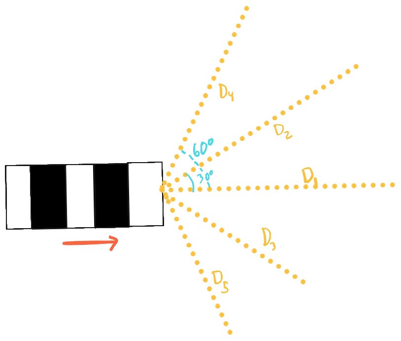
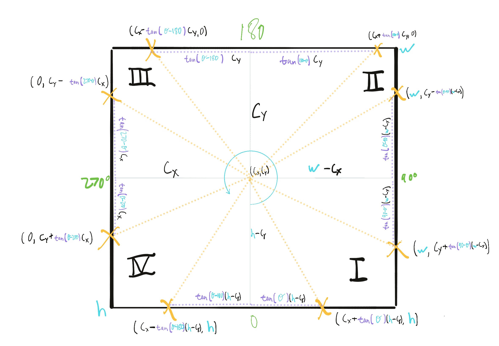
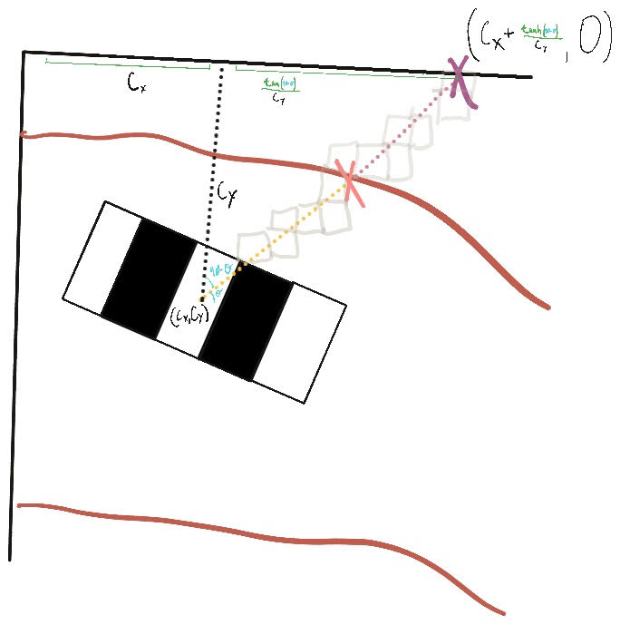
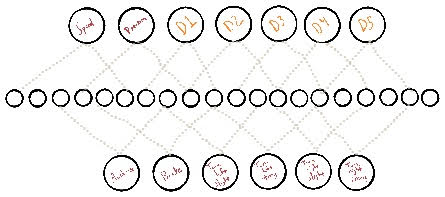
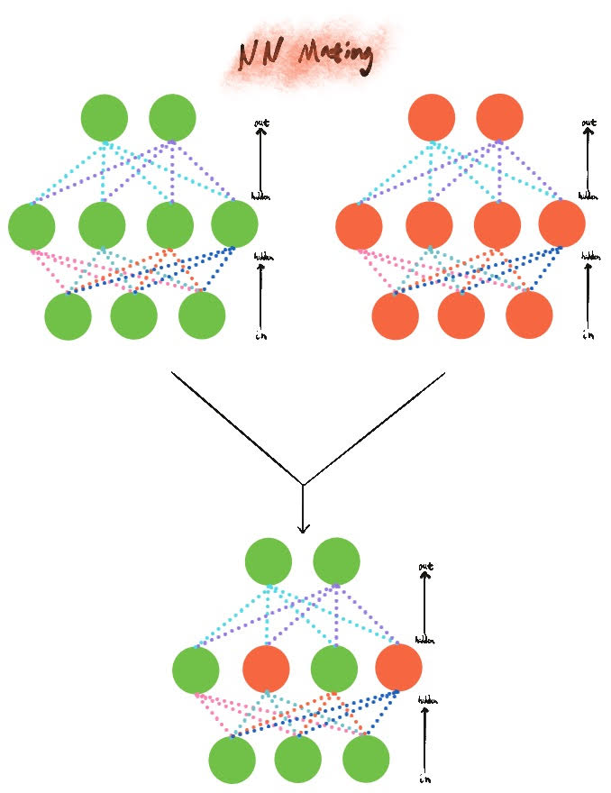

# evolving-cars
Having long been fascinated by the idea of evolutionary algorithms, I created a project that would demonstrate an agent be trained in a complex task - specifically race cars.


# Quickstart

```
python evolve.py tracks/track1.json 50
```

# How does this work?

## What do the race cars see?



The car, from its orientation and center, has 5 "lines" of measurement at -60, -30, 0, 30, and 60 degrees. They are visible in the game by pressing `d`. These distance represent the euclidean distance to the nearest non-open track pixel. Since the track treats anything at 0% opacity as "track" and anything else as "not track", we check the pixel opacity in its `RGBA` value to detect the collision.

To do this, we first calculate the "edge" intercept for the given angle's line, the edge being one of the edges of the track.



This code is handled in `distance_to_wall` in `track.py`. Using trigonometry, we calculate the pixel location of the intercept. If it goes beyond the pixel boundary of the track, we switch to the other calculation. Note that in pygame rotations move counterclockwise since we are in the fourth quadrant (upper left hand corner is `(0,0)`).

Once a line is detected, I use [Bresenham's Line Algorithm](https://en.wikipedia.org/wiki/Bresenham%27s_line_algorithm) to iterate over pixels that would fall onto this line, from the center out. Once we encounter an `RGBA` pixel without zero opacity, we mark that location as an "end point" for the line. From here we can calculate the euclidean distance to the center of the car.



## How do cars decide where to move?

Each car has a small neural network. While there were plans to implement multiple hidden layers, I found success with just a ten neuron hidden layer.



The neural network has an input layer consisting of:
* The car's current speed
* It's rotation (relative to the world)
* Each of the aforementioned five distances measured from the car

The output layer is whether or not to:

* Accelerate
* Deaccelerate
* Turn left slight (1 degree) or hard (4 degrees) (two neurons)
* Turn right slight (1 degree) or hard (4 degrees) (two neurons)

The output layer uses a sigmoid function to squash input between 0 and 1. If the output value is 0.5 or higher, the neuron is considered activate. If the car activates multiple neurons that disagree with eachother (accelerate and deaccelerate) it just results in nothing being changed.

The hidden layer consists of ReLu activation  functions and is a value between -1 and 1.

## How do the cars produce children?

Each car has a NN that is "mated" when the cars are selected to mate. A car's child has a NN in it that is the result of combining the two networks



When mating the two neural networks, we iterate over each weight between the input, hidden, and output layers. A `parentage_percentage` is set between parent A and parent B - defaulting to 50%. This percentage determines the likelihood we take a weight from parent A or parent B.

At each stage, we also consider the chance of an individual mutation. If a mutation is triggered on an individual weight, we generate a new value between -1 and 1. The mutation rate can be modified by using the `-` and `+` keys.

## How do I select cars to mate?

Cars have an internal score on each run. The top `N` cars - configurable from 2 to the entire population, changeable via the `[` and `]` keys - are selected as potential parents. *They are cloned to the next generation.* Then, cars are chosen as parents randomly. Cars can not "self-mate". Each car's chance of being chosen is based on a weighted random selection, its weight being its relative score to the other top-selected cars. As such, a high scoring car is likely to have more children.

## How do I calculate a car's score?

A car's score is determined by the following:

* **-50** points plus a point per second survived for crashing
* **150** points for each checkpoint passed, minus a point for each second elapsed since the start (ie crossing a checkpoint faster earns more points)
* **-100** points if a car never passes a checkpoint


Checkpoints are invisible unless toggled on by hitting `c` in game. They are points drawn during track creation in order to create a manageable way to reward cars.

The finish line is a special checkpoint that is also visible when `c` is hit - it is green versus the checkpoint yellow. The finish line awards no points but resets the checkpoint memory of a car, allowing them to earn points on their second lap.

## Pygame

I've been playing with algorithms for projects lately - and I've been building the tooling simulate them in. To speed things up, I used this project as a chance to learn pygame to speed up future simulations that need collision detection and sprite work. 

# Tools

* `evolve.py` - Launchs a track file and starts generating cars. See `Controls` to learn more about controls. When launched, needs a `track.json` file - there is one for each track made in the `tracks` folder. Example: `python evolve.py tracks/track1.json`. As an additional parameter, you can include a # (positive integer over 2) for the total population size.
- `create_track.py` - creates a `track.json` file that is used by `evolve.py`. When called, pass in the track image to be used and where you'd like the generated track.json file to be saved. For example: `python create_track.py assets/track1.png tracks/track1.json`. See `Creating Tracks` to learn more
- `manual.py` - A tool to drive a car around with the arrow keys - used to develop the game.

# Controls

Once in game, several commands are available to make life easier.

* `N` will immediately end the current generation so you don't have to wait for all cars to crash or the 60 second generation timeout to trigger.
* `[` and `]` will lower and raise the mating pool, respectively.
* `-` and `+` will lower and raise the mutation rate, respectively.
* `C` will show/hide the checkpoints and finish line.
* `D` will show/hide the distance measurement for each car

# Creating Tracks

```
python create_track.py <track img path> <track json output path>
```

To create a track, run the above command. The track image needs to be a `.png` file where the track is a zero opacity pixel.

Once you load the `create_track` tool, click to place the car's starting position. Click again using the red line to set starting orientation.

Then, click to place checkpoints. Hit `D` to cancel placing a checkpoint or to erase the last checkpoint.

Hit `RETURN` to end placing checkpoints. Now place a finish line to trigger a "lap" reset for the cars.